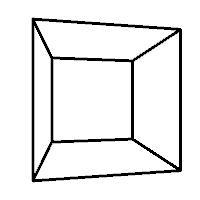

---
jupytext:
  formats: ipynb,md:myst
  text_representation:
    extension: .md
    format_name: myst
    format_version: 0.13
    jupytext_version: 1.10.3
kernelspec:
  display_name: Python 3
  language: python
  name: python3
---

# Render Helper Tools

These Render Helper Tools facilitate the creation of simple sketches.

Currently this is limited to the default and OpenGL renderers (P2D and P3D). I would like to add support for other renderers such as SVG at a later date.

```{code-cell} ipython3
from IPython.display import display

import py5
```

## Making a Single Image

Below is an introductory example showing how to make a single image.

The first parameter, `s: py5.Sketch`, includes a typehint. The typehint makes tab completion provide the right fields and methods, simplifying development.

```{code-cell} ipython3
def draw_square(s: py5.Sketch):
    s.background(240)
    s.rect_mode(s.CENTER)
    s.fill(255, 0, 0)
    s.rect(s.width / 2, s.height / 2, 50, 50)
```

Pass the newly created `draw_square` function to [render_frame()](/reference/py5functions_render_frame). It will render a single frame sketch with a width and height of `200, 200`. The result is returned as a [PIL Image object](https://pillow.readthedocs.io/en/stable/index.html).

```{code-cell} ipython3
img = py5.render_frame(draw_square, 200, 200)

print(type(img))
```

Here's what that image looks like:

```{code-cell} ipython3
img
```

Next, add some parameters to `draw_square` to parameterize the output.

```{code-cell} ipython3
def draw_square(s: py5.Sketch, fill_color, square_size):
    s.background(240)
    s.rect_mode(s.CENTER)
    s.fill(*fill_color)
    s.rect(s.width / 2, s.height / 2, square_size, square_size)
```

Below, use the new `draw_square` function with [render_frame()](/reference/py5functions_render_frame). Arguments are passed to `draw_square` via [render_frame()](/reference/py5functions_render_frame)'s `draw_kwargs` parameter.

You can pass positional arguments with `draw_args` but I think using keyword arguments is easier and more readable.

```{code-cell} ipython3
img = py5.render_frame(draw_square, 200, 200,
                       draw_kwargs=dict(fill_color=(255, 0, 255), square_size=100))

img
```

[@render](/reference/py5functions_render) is the [decorator](https://realpython.com/primer-on-python-decorators/) equivalent for [render_frame()](/reference/py5functions_render_frame). I think it achieves cleaner results, particularly when passing function arguments.

When using decorators, don't forget to type that `@` sign at the beginning. If you forget, like I just did while writing this documentation, it won't work correctly. :(

```{code-cell} ipython3
@py5.render(200, 200)
def draw_square(s: py5.Sketch, fill_color, square_size):
    s.background(240)
    s.rect_mode(s.CENTER)
    s.fill(*fill_color)
    s.rect(s.width / 2, s.height / 2, square_size, square_size)
```

Now you have an easy to use function that outputs images using the passed parameter values.

```{code-cell} ipython3
draw_square((255, 255, 0), 75)
```

You can make this more interesting with default arguments and the OpenGL renderer.

```{code-cell} ipython3
@py5.render(200, 200, py5.P2D)
def draw_square(s: py5.Sketch, fill_color, square_size=50):
    s.background(240)
    s.rect_mode(s.CENTER)
    s.fill(*fill_color)
    s.rect(s.width / 2, s.height / 2, square_size, square_size)
```

```{code-cell} ipython3
img1 = draw_square((0, 255, 255))
img2 = draw_square((255, 0, 0), square_size=10)

display(img1, img2)
```

Finally, apply what you've learned to make a more interesting example.

```{code-cell} ipython3
@py5.render(400, 100)
def draw_message(s: py5.Sketch, message, color=(255,)):
    s.background(0)
    s.text_size(40)
    s.text_align(s.CENTER, s.CENTER)
    s.fill(*color)
    s.text(message, s.width / 2, s.height / 2)
```

```{code-cell} ipython3
msg1 = draw_message('py5')
msg2 = draw_message('is')
msg3 = draw_message('awesome!', color=(255, 0, 0))

display(msg1, msg2, msg3)
```

Assembling that into an animated GIF is easy with the PIL Image library.

```{code-cell} ipython3
!mkdir -p images/render_helper/

msg1.save('images/render_helper/py5_is_awesome.gif',
          save_all=True, duration=500, loop=0, append_images=[msg2, msg3])
```

Here is the animated GIF:


+++

## Making a Series of Images

The Render Helper Tools can also create a sequence of images for an animation of some kind.

```{code-cell} ipython3
def draw_cubes(s: py5.Sketch, cube_size=50):
    s.background(255)
    s.no_fill()
    s.translate(s.width / 2, s.height / 2, 50)
    s.rotate_y(s.HALF_PI * s.frame_count / 10)
    s.box(cube_size)
```

Pass the `draw_cubes` function to [render_frame_sequence()](/reference/py5functions_render_frame_sequence) to return a list of [PIL Image object](https://pillow.readthedocs.io/en/stable/index.html).

```{code-cell} ipython3
cubes = py5.render_frame_sequence(draw_cubes, 200, 200, py5.P3D, limit=10)

cubes
```

```{code-cell} ipython3
display(cubes[0], cubes[5])
```

As before, a decorator is available. [@render_sequence](/reference/py5functions_render_sequence) is the decorator equivalent of [render_frame_sequence()](/reference/py5functions_render_frame_sequence).

```{code-cell} ipython3
@py5.render_sequence(200, 200, py5.P3D, limit=10)
def draw_cubes(s: py5.Sketch, cube_size=50):
    s.no_fill()
    s.background(255)
    s.translate(s.width / 2, s.height / 2, 50)
    s.rotate_y(s.HALF_PI * s.frame_count / 10)
    s.box(cube_size)
```

```{code-cell} ipython3
cubes = draw_cubes(75)

display(cubes[0], cubes[5])
```

Normally py5 sketches have a `setup()` method that is run once at the beginning of the animation. This method might be used to configure fill and stroke settings that should apply for every frame of the animation. You could leave those kinds of commands in the `draw_cubes()` function, but it might be nice to be able to break it out into a seperate `cube_setup()` function, like so:

```{code-cell} ipython3
def cube_setup(s: py5.Sketch):
    s.no_fill()
    s.stroke_weight(3)

@py5.render_sequence(200, 200, py5.P3D, limit=10, setup=cube_setup)
def draw_cubes(s: py5.Sketch, cube_size=50):
    s.background(255)
    s.translate(s.width / 2, s.height / 2, 50)
    s.rotate_y(s.HALF_PI * s.frame_count / 10)
    s.box(cube_size)
```

Now use the `draw_cubes` function and create an animated GIF.

```{code-cell} ipython3
cubes = draw_cubes(75)

first_cube = cubes[0]
first_cube.save('images/render_helper/rotating_cube.gif',
                save_all=True, duration=100, loop=0, append_images=cubes[1:])
```

Here is the GIF:



+++

In the previous example the [frame_count](/reference/sketch_frame_count) field was used to drive the animation, rotating the cube by a different angle in each frame. It worked well, but it might not always be easy or convenient to link changing animation state to [frame_count](/reference/sketch_frame_count). An alternative approach is to use the Python `global` keyword.

Below is the same example as before, but without depending on [frame_count](/reference/sketch_frame_count).

```{code-cell} ipython3
rot_y = 0

@py5.render_sequence(200, 200, py5.P3D, limit=10, setup=cube_setup)
def draw_cubes(s: py5.Sketch, cube_size=50):
    global rot_y
    s.background(255)
    s.translate(s.width / 2, s.height / 2, 50)
    # rot_y gets updated with each frame, changing the state
    rot_y += s.HALF_PI / 10
    s.rotate_y(rot_y)
    s.box(cube_size)
```

```{code-cell} ipython3
cubes = draw_cubes(75)
```

```{code-cell} ipython3
display(cubes[0], cubes[5])
```

## A Caveat

In both Processing and py5 it is unwise or impossible to run a sketch inside of another sketch.

These Render Helper Tools are creating and running sketches to provide their functionality. Although you might be tempted to do so, I do not recommend you use them in any way that places them inside of another running sketch.

```{code-cell} ipython3

```
